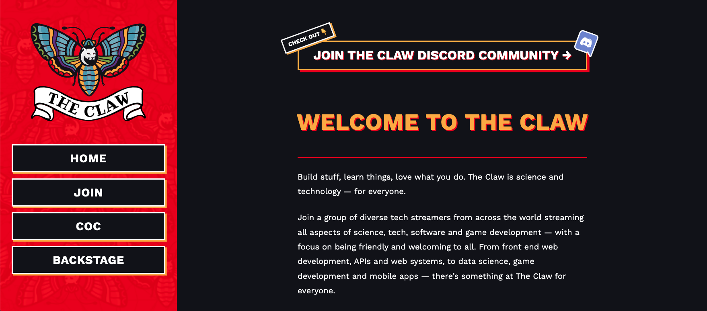
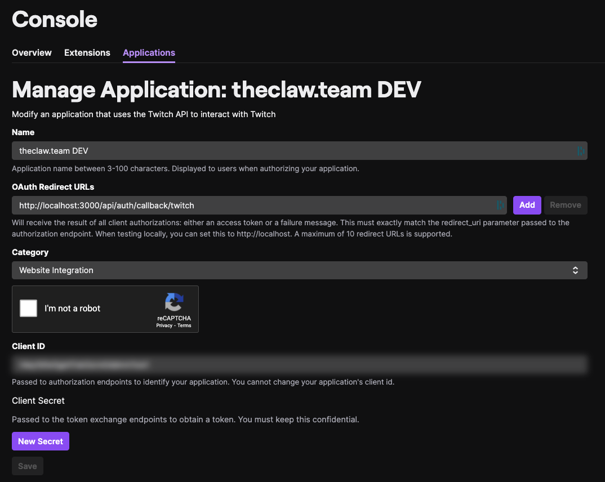

# theclaw.team



This project showcases The Claw Twitch stream team and uses the following services:

- [Contentful](https://contentful.com)
- Twitch authentication for team members via [next-auth](https://next-auth.js.org/)
- A DarkLang API developed by [jwalter](https://github.com/jwalter)


## Getting started

This is a [Next.js](https://nextjs.org/) project bootstrapped with
[`create-next-app`](https://github.com/vercel/next.js/tree/canary/packages/create-next-app).

To contribute to this project, fork the repository to your GitHub account, and clone it to your
local machine using git or the GitHub CLI.

### Install dependencies

```bash
cd path/to/folder
npm install
```

### Add environment variables to connect to services

Create a `.env` file at the root of the project.

```bash
cd path/to/folder
touch .env
```

Copy the environment variable keys from `.env.example` and add those into your `.env` file.

```text
CTFL_SPACE_ID=
CTFL_ACCESS_TOKEN=

TWITCH_CLIENT_ID=
TWITCH_CLIENT_SECRET=
NEXTAUTH_URL=http://localhost:3000
```

## Set up a new Contentful space

The project serves content from a Contentful space. Included in the repo is an export of the
content. You can use the Contentful CLI to populate a fresh Contentful space with data required for
this project.

- [Sign up to Contentful](https://contentful.com/sign-up)
- Create a new space inside your Contentful account
- Go to Settings > General Settings, grab the space ID and add it to your `.env` file

```text
CTFL_SPACE_ID={YOUR_NEW_SPACE_ID}
```

- Go to Settings > API keys and generate an access token for the Content Delivery API. Add this to
  your `.env` file:

```text
CTFL_ACCESS_TOKEN={YOUR_NEW_DELIVERY_ACCESS_TOKEN}
```

## Import the content model and data into your new Contentful space

- [Install the Contentful CLI using your preferred package manager](https://www.contentful.com/developers/docs/tutorials/cli/installation/)
- Log in to the CLI using `contentful login` and follow the instructions

Run the following commands in your terminal. Remember to swap out `{SPACE_ID}` for your new space
ID:

```bash
cd path/to/project
contentful space import --space-id {SPACE_ID} --content-file setup/content.json
```

You should now have the content model and content populated for you to run the project.

## Set up a new Twitch app

The project requires a connection to a Twitch application in order to enable Twitch authentication.

[Learn how to get started with the Twitch API](https://dev.twitch.tv/docs/api).

- Create a new Twitch application
- Add the following OAuth Redirect URL to your new app:
  `http://localhost:3000/api/auth/callback/twitch`
- Create a Client ID and Client Secret



Add the following credentials to your `.env` file:

```text
TWITCH_CLIENT_ID={YOUR_NEW_CLIENT_ID}
TWITCH_CLIENT_SECRET={YOUR_NEW_CLIENT_SECRET}
NEXTAUTH_URL=http://localhost:3000
```

### Run the development server

```bash
npm run dev
```

Open [http://localhost:3000](http://localhost:3000) to view the project running locally.

## Learn More about Next.js

To learn more about Next.js, take a look at the following resources:

- [Next.js Documentation](https://nextjs.org/docs) - learn about Next.js features and API.
- [Learn Next.js](https://nextjs.org/learn) - an interactive Next.js tutorial.

You can check out [the Next.js GitHub repository](https://github.com/vercel/next.js/) - your
feedback and contributions are welcome!

## Production environment

This project is hosted on Vercel. When you make a pull request, the owner of the organisation will
be asked to authorise the deploy preview to kick off a build.

When the deploy preview is ready, the pull request will update with a URL.
